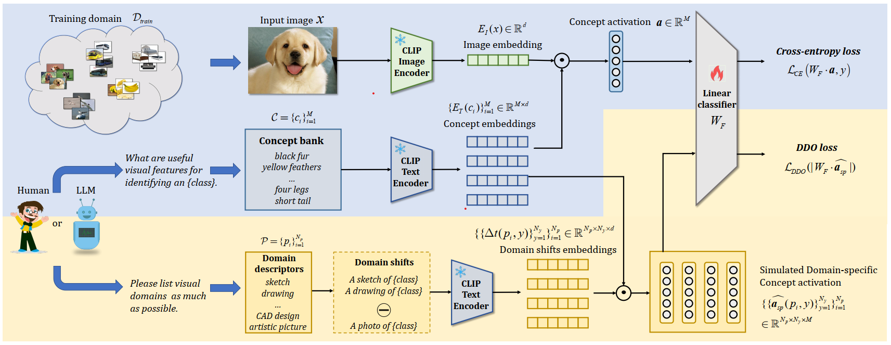

# [CVPR 2025] Explaining Domain Shifts in Language: Concept erasing for Interpretable Image Classification

**Authors**:
[Zequn Zeng](https://joeyz0z.github.io/),
[Yudi Su](),
[Jianqiao Sun](),
[Tiansheng Wen](),
[Hao Zhang](https://scholar.google.com/citations?user=Eo8e5icAAAAJ),
[Zhengjue Wang](https://scholar.google.com/citations?user=qTQj_I4AAAAJ),
[Bo Chen](https://scholar.google.com/citations?user=uv16_-UAAAAJ),
[Hongwei Liu](),
[Jiawei Ma](),
<br/>
Official implementation of LanCE.

[comment]: <> ([![Project Website]&#40;https://img.shields.io/badge/Project-Website-orange&#41;]&#40;https://tuneavideo.github.io/&#41;)
[](https://arxiv.org/abs/2503.18483)


[comment]: <> (![Local Image]&#40;assets/model.png&#41;)
<div align = center>

</div>

<br/>


***

## Catalogue:
* <a href='#introduction'>Introduction</a>
* <a href='#citation'>Citation</a>
* <a href='#data'>Data Preparation</a>
* <a href='#inference'>Train</a>
* <a href='#acknowledgments'>Acknowledgments</a>

<span id = 'introduction'/>

***

## Introduction
Concept-based models can map black-box representations to human-understandable concepts, 
which makes the decision-making process more transparent and then allows  users to understand the reason behind predictions. 
However, domain-specific concepts often impact the final predictions, which subsequently undermine the model generalization capabilities, and prevent the model from being used in high-stake applications. 
In this paper, we propose a novel Language-guided Concept-Erasing (LanCE) framework. 
In particular, we empirically demonstrate that pre-trained vision-language models (VLMs) can approximate distinct visual domain shifts via domain descriptors while prompting large Language Models (LLMs) can easily simulate a wide range of descriptors of unseen visual domains. 
Then, we introduce a novel plug-in domain descriptor orthogonality (DDO) regularizer to mitigate the impact of these domain-specific concepts on the final predictions. 
Notably, the DDO regularizer is agnostic to the design of conceptbased models and we integrate it into several prevailing models. 
Through evaluation of domain generalization on four standard benchmarks and three newly introduced benchmarks, we demonstrate that DDO can significantly improve the out-of-distribution (OOD) generalization over the previous state-of-the-art concept-based models.

<span id = 'citation'/>


## Citation
If you think LanCE is useful, please cite these papers!
```
@article{zeng2025explaining,
  title={Explaining Domain Shifts in Language: Concept erasing for Interpretable Image Classification},
  author={Zeng, Zequn and Su, Yudi and Sun, Jianqiao and Wen, Tiansheng and Zhang, Hao and Wang, Zhengjue and Chen, Bo and Liu, Hongwei and Ma, Jiawei},
  journal={arXiv preprint arXiv:2503.18483},
  year={2025}
}

@inproceedings{zeng2023conzic,
  title={Conzic: Controllable zero-shot image captioning by sampling-based polishing},
  author={Zeng, Zequn and Zhang, Hao and Lu, Ruiying and Wang, Dongsheng and Chen, Bo and Wang, Zhengjue},
  booktitle={Proceedings of the IEEE/CVF conference on computer vision and pattern recognition},
  pages={23465--23476},
  year={2023}
}
```
<span id = 'data'/>

***
## Data Preparation 

### Environment
Prepare the python environment:
```
pip install -r requirements.txt
```


### Download Data
In this paper, we propose three new datasets, [AwA2-clipart](https://huggingface.co/datasets/JoeyZoZ/AwA2_clipart), [LADV-3D](https://huggingface.co/datasets/JoeyZoZ/LADV-3D), and [LADA-Sculpture](https://huggingface.co/datasets/JoeyZoZ/LADA-Sculpture). Besides, we also conduct experiments on some classic datasets like CUB-Painting.
Different datasets can be downloaded via the following link.
Please download corresponding datasets and put them into ./data .

| Datasets               | Download link  | style |
|-------------------------|----------------|----------------|
| CUB                    | [link](https://www.vision.caltech.edu/datasets/cub_200_2011/)       | photo |
| CUB-Painting           | [link](https://drive.google.com/file/d/1G327KsD93eyGTjMmByuVy9sk4tlEOyK3/view?usp=sharing)       | painting|
| AwA2                   | [link](https://hf-mirror.com/datasets/mikewang/AwA2)       | photo|
| AwA2-clipart           | [link](https://huggingface.co/datasets/JoeyZoZ/AwA2_clipart)       | clipart |
| LADA                   | [link](https://github.com/PatrickZH/A-Large-scale-Attribute-Dataset-for-Zero-shot-Learning)       | real|
| LADA-Sculpture         | [link](https://huggingface.co/datasets/JoeyZoZ/LADA-Sculpture)       | Sculpture|
| LADV                   | [link](https://github.com/PatrickZH/A-Large-scale-Attribute-Dataset-for-Zero-shot-Learning)       | real|
| LADV-3D                | [link](https://huggingface.co/datasets/JoeyZoZ/LADV-3D)       | 3D model|

The data structure is as follows:
```
data
└── CUB
    ├── CUB_200_2011
    │   ├── images
    │   ├── 
    │   └── 
    ├── CUB-200-Painting
    │   ├── images
    │   ├── 
    │   └── 
    └── ...    
```

<span id = 'Train'/>

***
## Train

### CLIP CBM
Train a CLIP CBM:
```
python main.py --dataset CUB --alpha 0  --class_avg_concept --CBM_type clip_cbm --wandb
```
Train a CLIP CBM + DDO loss:
```
python main.py --dataset CUB --alpha 1  --class_avg_concept --CBM_type clip_cbm --wandb
```


### CLIP Zero-shot
For CLIP zero-shot image classification.
```
python main_zeroshot.py --dataset CUB   --class_avg_concept --prompt_type origin --wandb
```
<span id = 'Acknowledgements'/>

## Acknowledgements

This code is heavily depend on [ConZIC](https://github.com/joeyz0z/ConZIC), [LADS](https://github.com/lisadunlap/LADS) and [LaBO](https://github.com/YueYANG1996/LaBo).

Thanks for their good work.

